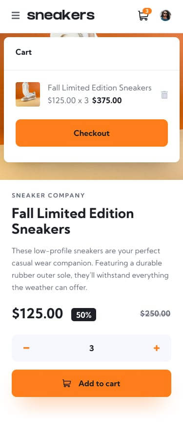

# 🛍️ Simple E-commerce Product Page


A responsive and interactive E-commerce product page built with **HTML**, **CSS**, and **JavaScript**. This project features a sleek layout with a lightbox image gallery for enhanced product viewing and includes basic cart functionality that allows users to add, update, and remove items. The design is optimized for both desktop and mobile, offering a smooth and engaging shopping experience for users.

---

## ✨ Features

- 🖼️ Lightbox product image gallery with thumbnails  
- 🛒 Add to cart and update cart quantity  
- 🧹 Clear cart functionality  
- 📱 Responsive design for mobile and desktop  
- 🔥 Clean and modern UI  

---

## 🚀 Getting Started

1. Clone the repository:
   ```bash
   git clone https://github.com/Amine4jh/e-commerce-product-page.git
   ```
2. Open `index.html` in your browser.

---

## 🙌 Acknowledgments

- Inspired by real-world utility apps  
- Built for learning and practice

---

## 📱 Mobile Design

<p>
   
   
   
</p>
